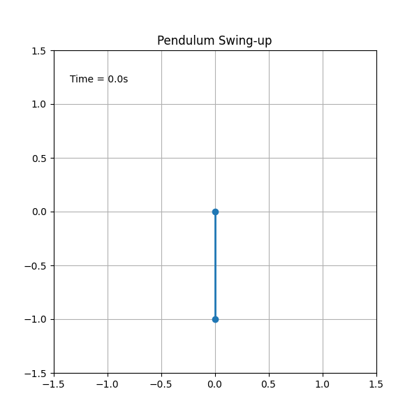
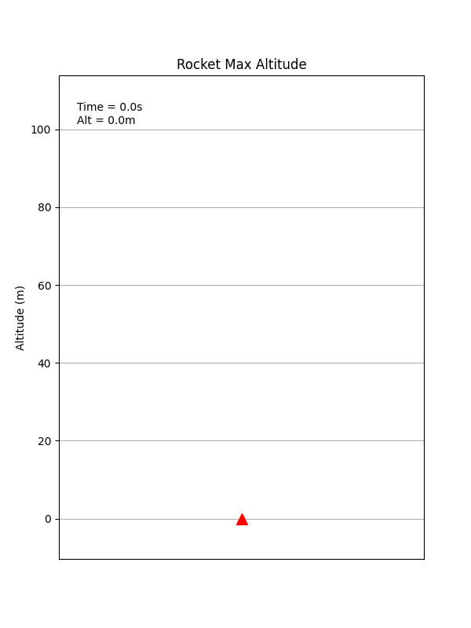
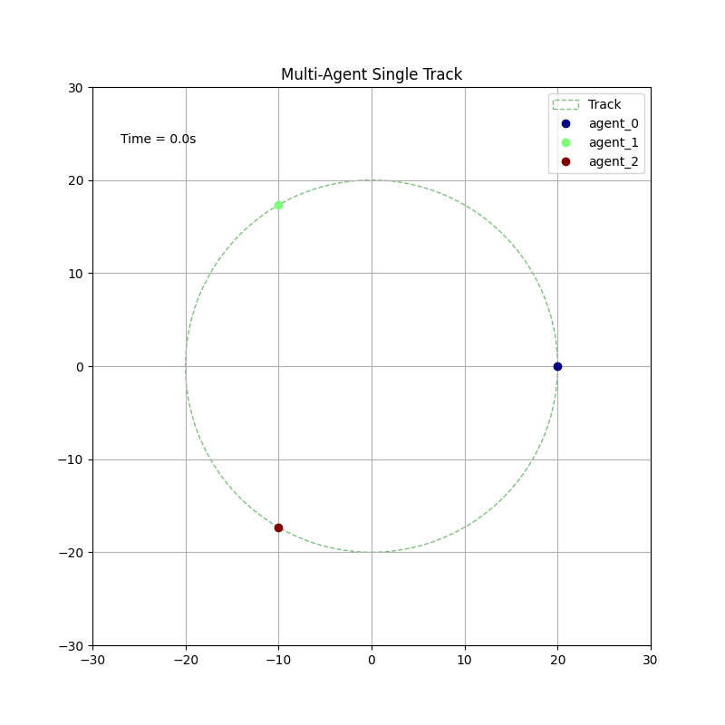

# MultiAgentSolver

MultiAgentSolver is a high-performance C++ library designed to solve multi-agent optimization problems. The library includes solvers such as:

* **CGD (Constrained Gradient Descent)** 
* **iLQR (Iterative Linear Quadratic Regulator)** 
* **OSQP Solver** utilizing the osqp library

Additionally, it supports multi-agent coordination through Nash Equilibrium-based optimization and for comparison combining multiple agents into one big optimization problem.

## 📖 Table of Contents

- [Examples](#-examples)
  - [Pendulum Swing Up](#pendulum-swing-up)
  - [Rocket Max Altitude](#rocket-max-altitude)
  - [Multi-Agent Single Track](#multi-agent-single-track)
- [Building and Running](#-building-and-running)
- [Results](#results)
- [Project Structure](#-project-structure)
- [Contribution Guide](#contribution-guide)

## 🚀 Examples

### Pendulum Swing Up

The classic control problem: swing a pendulum from a resting down position to balance it upright. This example uses an **Energy Shaping** cost formulation to robustly swing up the pendulum by minimizing the difference between the current total energy and the desired potential energy at the top.



**Run it:**
```bash
./build/release/pendulum_swing_up --solver ilqr
```

**Generate the animation:**
```bash
./scripts/animate_example.py pendulum_swing_up -- --solver ilqr
```

### Rocket Max Altitude

Maximize the altitude of a vertical rocket given a limited mass of fuel. The solver must optimize the thrust profile to go as high as possible while battling gravity and drag (if modeled), and ensuring the fuel mass doesn't drop below zero.



**Run it:**
```bash
./build/release/rocket_max_altitude --solver cgd
```

**Generate the animation:**
```bash
./scripts/animate_example.py rocket_max_altitude -- --solver cgd
```

### Multi-Agent Single Track

Multiple agents (cars) independently trying to maintain a target velocity on a circular track. This demonstrates the framework's ability to handle multiple systems simultaneously.



**Run it:**
```bash
./build/release/multi_agent_single_track --agents 3 --solver ilqr --strategy trustregion
```

**Generate the animation:**
```bash
./scripts/animate_example.py multi_agent_single_track -- --agents 3 --solver ilqr --strategy trustregion
```

---

## 🛠️ **Dependencies**

* **Eigen3** - Linear algebra
* **OSQP** - Optimization solver
* **OsqpEigen** - Eigen wrapper for OSQP
* **OpenMP** - Multi-threading support

All dependencies can be automatically installed with the `setup_dependencies.sh` script.

> **Tip:** On host machines you can customise how dependencies are installed:
>
> ```bash
> ./scripts/setup_dependencies.sh              # install system packages (if supported) and build third-party libraries
> ./scripts/setup_dependencies.sh --no-system-packages  # skip package manager operations (dependencies already installed)
> PREFIX="$HOME/.local" ./scripts/setup_dependencies.sh  # install OSQP/OsqpEigen into a custom prefix
> ```

---

## 📦 **Building with Docker**

The recommended way to build and run the project is using Docker. This ensures a clean environment and reproducible builds.

```bash
./scripts/run_docker.sh
```

## 📝 **Manual Build (Without Docker)**

If you prefer to build manually:

```bash
./scripts/setup_dependencies.sh
./scripts/build.sh
```

The build helper understands both `./scripts/build.sh Release` and `./scripts/build.sh --build-type Release`.

### **Utility scripts**

The repository includes Python helpers for benchmarking and visualising the example executables. Both scripts accept `--help` for the full list of options.

* **Compare solvers** – build the project (unless `--skip-build` is supplied) and benchmark multiple solver/strategy combinations:

  ```bash
  ./scripts/compare_solvers.py --build-type Release --examples multi_agent_lqr multi_agent_single_track \
      --solvers ilqr cgd --strategies centralized sequential --agents 8
  ```

* **Plot trajectories** – run a single example and plot the CSV-style trajectories it prints.

  ```bash
  ./scripts/plot_example.py multi_agent_lqr -- --agents 4 --solver ilqr --strategy sequential
  ```

* **Animate examples** – generate GIFs for supported examples (pendulum, rocket, track).

  ```bash
  ./scripts/animate_example.py pendulum_swing_up -- --solver ilqr
  ```

## 📂 **Project Structure**

```
├── CMakeLists.txt             # CMake build configuration
├── Dockerfile                 # Docker setup
├── include                    # Header files
│   └── MultiAgentSolver
├── src                        # Source files
├── examples                   # Example applications
├── scripts                    # Helper scripts
│   ├── build.sh
│   ├── run.sh
│   ├── setup_dependencies.sh
│   ├── animate_example.py     # Generate GIFs
│   └── plot_example.py        # Plot static graphs
├── cmake                      # CMake configuration files
├── build                      # Build artifacts
└── README.md                  # Project documentation
```

## Results

Times and costs for different methods in the example code:

```
🚗 Single-Track Lane Following Test 🚗
---------------------------------------------
Solver              Cost           Time (ms)
     ---------------------------------------------
CGD                 24.0465        20.6444        
OSQP                30.1889        2.33275        
OSQP Collocation    23.9809        5.11993        
iLQR                24.4039        1.06887 
```

```
Multi-Agent Single Track Test

Method                                  Cost           Time (ms)      
----------------------------------------------------------------------
Centralized CGD                         7928.151       1214.919       
Centralized iLQR                        7928.501       135.472        
Centralized OSQP                        7929.011       285.711        
...
```

## License
Apache 2.0

## Project status
WIP  - still early in development but working.
